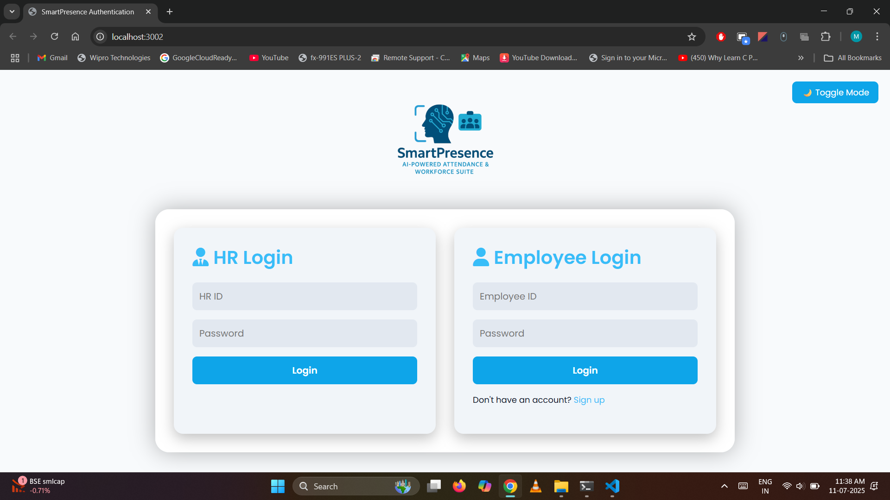
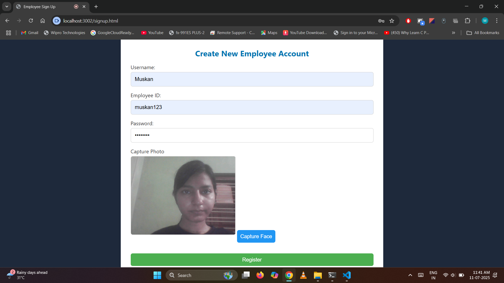
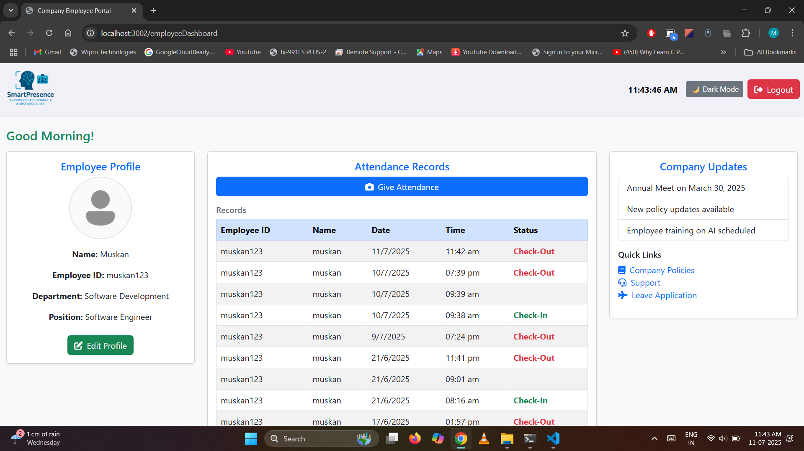
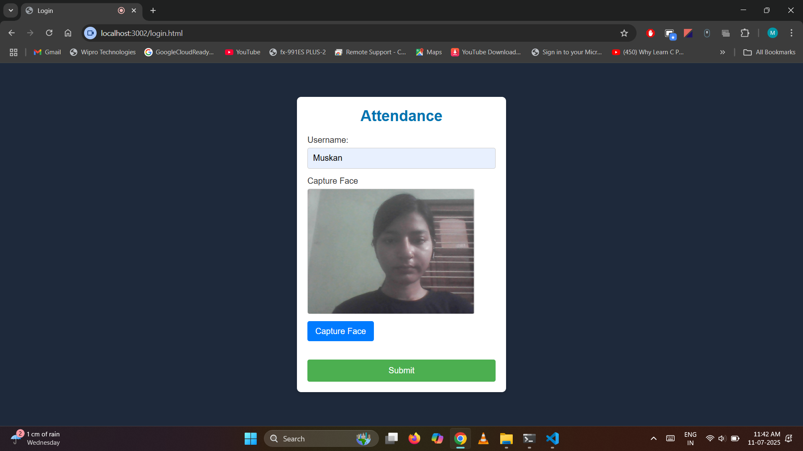
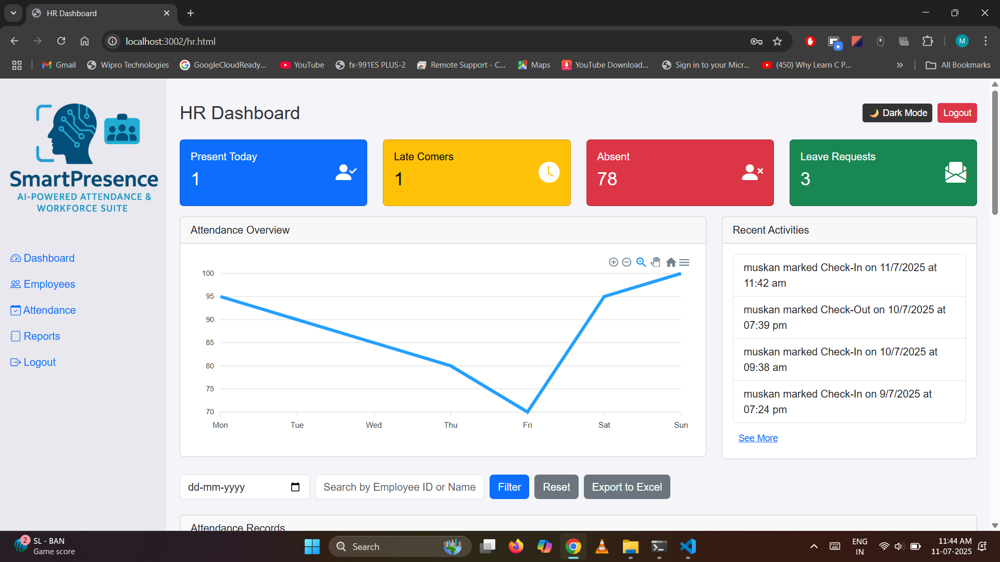
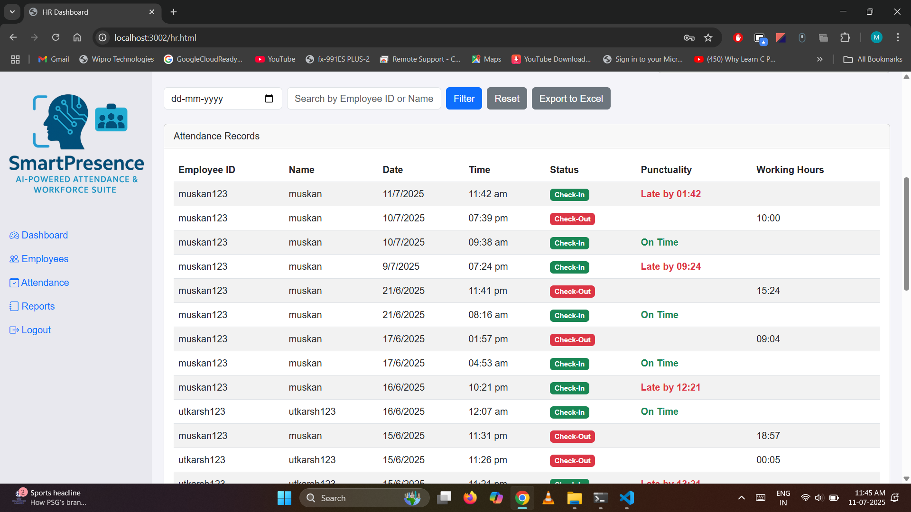

# SmartPresence – AI-Powered Attendance & Workforce Suite 

SmartPresence is a secure, AI-powered attendance and workforce management system designed for both HR and Employees. It integrates facial recognition, login authentication, and employee status management to streamline attendance tracking and employee monitoring.

## 🚀 Features

- 🔐 **Secure HR & Employee Login**
- 🧑‍💼 **New Employee Registration** with face capture
- 👁️‍🗨️ **Face Recognition-based Attendance System**
- 📅 **Employee Attendance Dashboard**
- 📊 **HR Dashboard** 
- 🌙 **Light/Dark Mode Toggle**
- 📤 **Export Attendance to Excel**

---

## 📸 Screenshots

### 🔵 Authentication Page


### 🟢 New Employee Registration


### 🟣 Employee Dashboard


### 🟡 Employee Attendance page


### 🔴 HR Dashboard


---

## 🛠️ Tech Stack

- **Frontend**: HTML, CSS, JavaScript, Bootstrap
- **Backend**: Node.js, Express.js
- **Database**: MySQL
- **Face Recognition**: OpenCV, face_recognition (Python)
- **Security**: Sessions

---

## 📦 Run Locally

```bash
git clone https://github.com/yourusername/smartpresence.git
cd smartpresence
npm install
